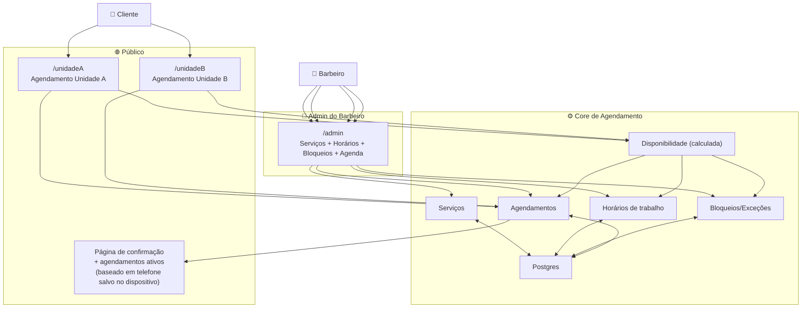
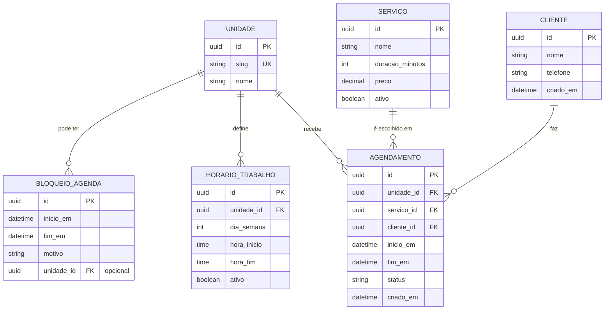
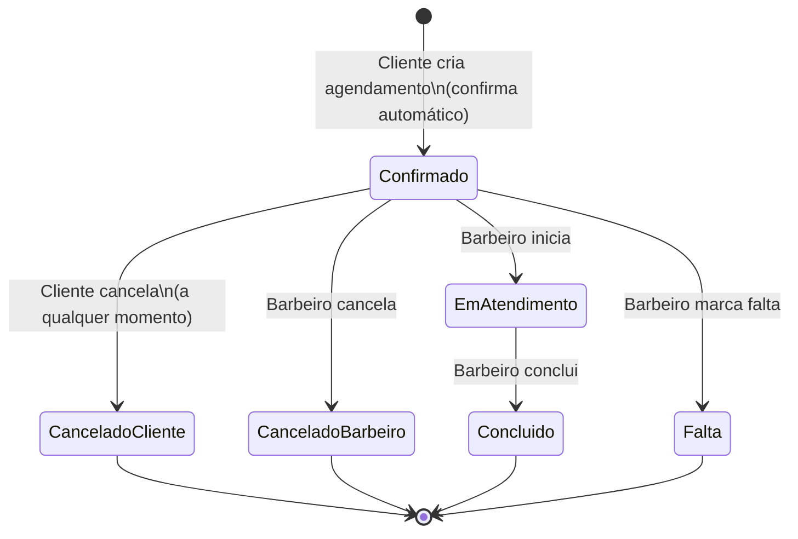

# CONTEXTO DE NEGÓCIO (COMPLETO) — Sistema de Agendamento — Barbeiro Único com 2 Barbearias

**Data:** 04/02/2026  
**Stack (implementação):** Railway + Postgres + Prisma (referência técnica)

---

## 📍 PROBLEMA
**Data:** 04/02/2026

## Quem
- **Barbeiro único**, sem funcionários.
- Atende em **duas barbearias (Unidade A e Unidade B)**.
- O barbeiro define e edita **dias/horários de trabalho** para cada unidade.

## Situação atual
- **Não existe sistema de agendamento ainda** (projeto do zero).
- O cliente precisa conseguir marcar horário de forma simples, com a regra de que a disponibilidade depende da unidade e do dia/horário configurado pelo barbeiro.

## Causa raiz
- Falta uma agenda centralizada que:
  - aplique as regras de disponibilidade por unidade (definidas pelo barbeiro);
  - calcule horários livres a partir de **horários de trabalho + bloqueios + agendamentos existentes**;
  - impeça **conflitos/sobreposição** (é um barbeiro só).

## Consequência (se não resolver bem)
- Cliente não consegue agendar (perda de oportunidade).
- Confusão de unidade/dia, slots “fantasmas” e conflitos de agenda.
- Retrabalho para o barbeiro corrigir manualmente.

## Como o sistema resolve
- Agendamento público por páginas separadas:
  - `.../unidadeA`
  - `.../unidadeB`
- O cliente escolhe serviço e horário disponível.
- Antes de finalizar, informa **nome + telefone** (sem conta e sem senha).
- O sistema **salva esse contato no dispositivo** (ex.: localStorage/cache) para:
  - **pré-preencher** em visitas futuras;
  - permitir uma página de confirmação que liste **agendamentos ativos** do telefone naquele dispositivo, com opção de **cancelar**.

> 💡 Em uma frase: um barbeiro único com duas unidades precisa de agendamento online que publique disponibilidade real por unidade, evite conflitos e permita ao cliente cancelar — sem exigir conta, só nome+telefone com pré-preenchimento no próprio dispositivo.

---

## 👥 ATORES
## Usuários (pessoas)
| Ator | O que faz | O que precisa |
|---|---|---|
| **Cliente (público)** | Acessa `/unidadeA` ou `/unidadeB`, escolhe serviço e horário | Ver dias/horários disponíveis da unidade, informar nome+telefone para finalizar |
| **Cliente (mesmo dispositivo)** | Retorna ao site | Ter contato pré-preenchido (nome+telefone) e ver/cancelar **agendamentos ativos** associados ao telefone |
| **Barbeiro (admin)** | Configura e opera o sistema | CRUD serviços, definir/editar horários por unidade, criar bloqueios, ver agenda, cancelar, marcar concluído/falta |

## Sistemas externos
| Sistema | Por que | V1 |
|---|---|---|
| Nenhum obrigatório | V1 funciona com Web + Postgres | ✅ |

## Automações (jobs)
| Job | Quando roda | O que faz | V1 |
|---|---|---|---|
| **Cálculo de disponibilidade** | Sob demanda (quando abrir a página) | Deriva slots de horário a partir de horários de trabalho − agendamentos − bloqueios | ✅ |
| Lembretes | 24h/2h antes | Notificar cliente | ❌ (V2) |

## Diagrama (mapa de atores)

---

## 📦 ENTIDADES
## Entidades principais (V1)
| Entidade | Para que existe | Campos essenciais (V1) |
|---|---|---|
| **Unidade** | Representa as barbearias e sustenta páginas por unidade | `id`, `slug` (unidadeA/unidadeB), `nome` |
| **Serviço** | O que o cliente escolhe | `id`, `nome`, `duracao_minutos`, `preco`, `ativo` |
| **HorárioTrabalho** | Regra semanal editável por unidade | `id`, `unidade_id`, `dia_semana (0-6)`, `hora_inicio`, `hora_fim`, `ativo` |
| **BloqueioAgenda** | Exceções (folga/compromisso/bloqueio) | `id`, `inicio_em`, `fim_em`, `motivo`, `unidade_id (opcional)` |
| **Cliente** | Identifica o cliente para vincular agendamentos | `id`, `nome`, `telefone`, `criado_em` |
| **Agendamento** | Reserva de horário | `id`, `unidade_id`, `servico_id`, `cliente_id`, `inicio_em`, `fim_em`, `status`, `criado_em` |

## Regras de negócio que impactam modelagem
- **Disponibilidade é derivada (não tabela):**  
  `HorárioTrabalho` − `Agendamentos (ativos)` − `Bloqueios`.
- **Um barbeiro só → zero sobreposição**, mesmo entre unidades.
- **Sem conta/senha:** cliente informa **nome + telefone** para finalizar; o front-end pode **armazenar localmente** para pré-preencher e recuperar “agendamentos ativos” daquele telefone no mesmo dispositivo.

## ERD (Mermaid)

---

## ⚡ CICLO DE VIDA
## Entidade central: Agendamento

### Estados (V1)
| Estado | Significado |
|---|---|
| **Confirmado** | Agendamento criado com sucesso (entra confirmado automaticamente) |
| **CanceladoCliente** | Cliente cancelou (a qualquer momento) |
| **CanceladoBarbeiro** | Barbeiro cancelou |
| **EmAtendimento** | Barbeiro iniciou o atendimento |
| **Concluido** | Atendimento finalizado |
| **Falta** | Cliente não compareceu (marcado pelo barbeiro) |

### Eventos e transições
| Evento | Quem | De → Para | Ação do sistema |
|---|---|---|---|
| `AgendamentoCriado` | Cliente | *(novo)* → **Confirmado** | Calcula `fim_em` pela duração do serviço; valida conflito; salva |
| `ClienteCancelou` | Cliente | **Confirmado** → **CanceladoCliente** | Libera slot (por derivação) |
| `BarbeiroCancelou` | Barbeiro | **Confirmado** → **CanceladoBarbeiro** | Libera slot |
| `AtendimentoIniciado` | Barbeiro | **Confirmado** → **EmAtendimento** | Registra início (opcional) |
| `AtendimentoConcluido` | Barbeiro | **EmAtendimento** → **Concluido** | Registra conclusão |
| `FaltaMarcada` | Barbeiro | **Confirmado** → **Falta** | Registra falta |

### Diagrama de estados (Mermaid)

## Experiência do cliente (sem login)
- Fluxo de agendamento pede **nome + telefone** antes de finalizar.
- O front-end guarda o contato no dispositivo (ex.: `localStorage`) para pré-preencher no futuro.
- A página de confirmação pode consultar por **telefone** e mostrar os **agendamentos ativos** para cancelar.

> Nota: como não há autenticação forte, o “gerenciar agendamentos” é **conveniente**, não “seguro”. V2 pode incluir verificação por código (OTP) se necessário.

---

## 🎯 ESCOPO V1
## ✅ Entra na V1 (essencial)

### Público (cliente)
- Páginas separadas:
  - `/unidadeA`
  - `/unidadeB`
- Listar **serviços ativos**
- Exibir **disponibilidade real** (slots calculados)
- Criar agendamento com **confirmação automática**
- Antes de finalizar: coletar **nome + telefone**
- **Salvar contato no dispositivo** (cache/localStorage) para pré-preenchimento em visitas futuras
- Página de confirmação exibindo:
  - dados do agendamento criado
  - lista de **agendamentos ativos** do telefone (quando disponível no dispositivo)
  - ação de **cancelar** (a qualquer momento)

### Admin (barbeiro)
- CRUD de **Serviços** (criar/editar/remover/ativar/desativar)
- CRUD de **Horários de trabalho** por unidade (dia da semana + janelas)
- CRUD de **Bloqueios** (períodos fechados)
- Visualizar agenda por dia/semana
- Cancelar agendamento
- Marcar: Em atendimento / Concluído / Falta

### Regras
- Impedir **sobreposição** de agendamentos (um barbeiro só)
- Disponibilidade sempre consistente com horários + bloqueios + agendamentos

## ❌ Fora da V1 (V2+)
- Lembretes (WhatsApp/SMS/Email)
- Verificação por código (OTP) / autenticação de verdade
- Pagamento / sinal
- Reagendamento (em vez de cancelar + criar)
- Integração Google Calendar
- Relatórios avançados

## ✅ Critério de pronto (Definition of Done da V1)
- Cliente consegue:
  1) entrar em `/unidadeA` ou `/unidadeB`  
  2) ver horários disponíveis reais  
  3) escolher serviço e agendar informando nome+telefone  
  4) ver confirmação e cancelar a qualquer momento  
  5) voltar no mesmo dispositivo e ter **nome+telefone pré-preenchidos**
- Barbeiro consegue:
  1) manter serviços  
  2) configurar horários por unidade  
  3) bloquear períodos  
  4) ver agenda e operar status  
- Sistema garante:
  - **zero conflito** (sem sobreposição)
  - disponibilidade derivada corretamente (sem slots fantasma)
