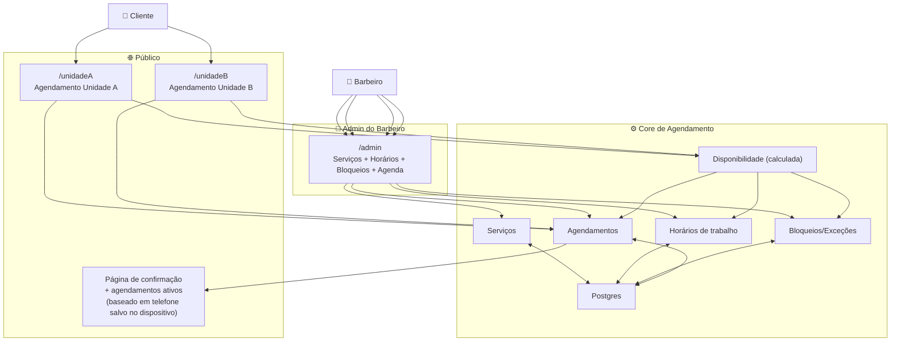

# ATORES — Sistema de Agendamento — Barbeiro Único com 2 Barbearias

## Usuários (pessoas)
| Ator | O que faz | O que precisa |
|---|---|---|
| **Cliente (público)** | Acessa `/unidadeA` ou `/unidadeB`, escolhe serviço e horário | Ver dias/horários disponíveis da unidade, informar nome+telefone para finalizar |
| **Cliente (mesmo dispositivo)** | Retorna ao site | Ter contato pré-preenchido (nome+telefone) e ver/cancelar **agendamentos ativos** associados ao telefone |
| **Barbeiro (admin)** | Configura e opera o sistema | CRUD serviços, definir/editar horários por unidade, criar bloqueios, ver agenda, cancelar, marcar concluído/falta |

## Sistemas externos
| Sistema | Por que | V1 |
|---|---|---|
| Nenhum obrigatório | V1 funciona com Web + Postgres | ✅ |

## Automações (jobs)
| Job | Quando roda | O que faz | V1 |
|---|---|---|---|
| **Cálculo de disponibilidade** | Sob demanda (quando abrir a página) | Deriva slots de horário a partir de horários de trabalho − agendamentos − bloqueios | ✅ |
| Lembretes | 24h/2h antes | Notificar cliente | ❌ (V2) |

## Diagrama (mapa de atores)

