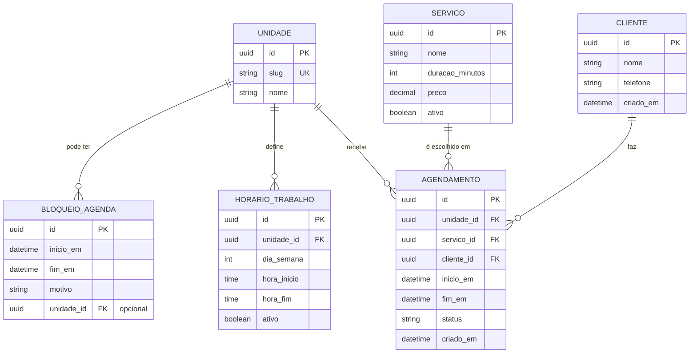

# ENTIDADES — Sistema de Agendamento — Barbeiro Único com 2 Barbearias

## Entidades principais (V1)
| Entidade | Para que existe | Campos essenciais (V1) |
|---|---|---|
| **Unidade** | Representa as barbearias e sustenta páginas por unidade | `id`, `slug` (unidadeA/unidadeB), `nome` |
| **Serviço** | O que o cliente escolhe | `id`, `nome`, `duracao_minutos`, `preco`, `ativo` |
| **HorárioTrabalho** | Regra semanal editável por unidade | `id`, `unidade_id`, `dia_semana (0-6)`, `hora_inicio`, `hora_fim`, `ativo` |
| **BloqueioAgenda** | Exceções (folga/compromisso/bloqueio) | `id`, `inicio_em`, `fim_em`, `motivo`, `unidade_id (opcional)` |
| **Cliente** | Identifica o cliente para vincular agendamentos | `id`, `nome`, `telefone`, `criado_em` |
| **Agendamento** | Reserva de horário | `id`, `unidade_id`, `servico_id`, `cliente_id`, `inicio_em`, `fim_em`, `status`, `criado_em` |

## Regras de negócio que impactam modelagem
- **Disponibilidade é derivada (não tabela):**  
  `HorárioTrabalho` − `Agendamentos (ativos)` − `Bloqueios`.
- **Um barbeiro só → zero sobreposição**, mesmo entre unidades.
- **Sem conta/senha:** cliente informa **nome + telefone** para finalizar; o front-end pode **armazenar localmente** para pré-preencher e recuperar “agendamentos ativos” daquele telefone no mesmo dispositivo.

## ERD (Mermaid)

