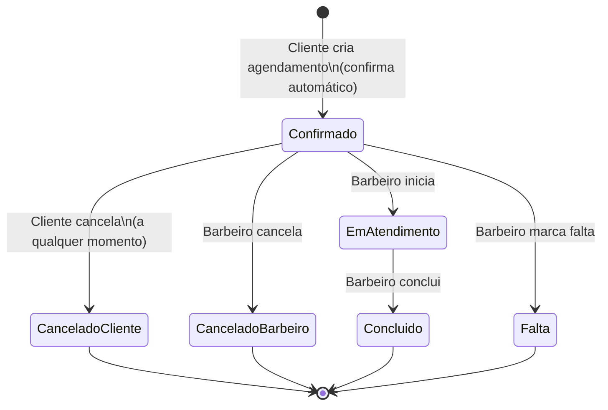

# CICLO DE VIDA — Sistema de Agendamento — Barbeiro Único com 2 Barbearias

## Entidade central: Agendamento

### Estados (V1)
| Estado | Significado |
|---|---|
| **Confirmado** | Agendamento criado com sucesso (entra confirmado automaticamente) |
| **CanceladoCliente** | Cliente cancelou (a qualquer momento) |
| **CanceladoBarbeiro** | Barbeiro cancelou |
| **EmAtendimento** | Barbeiro iniciou o atendimento |
| **Concluido** | Atendimento finalizado |
| **Falta** | Cliente não compareceu (marcado pelo barbeiro) |

### Eventos e transições
| Evento | Quem | De → Para | Ação do sistema |
|---|---|---|---|
| `AgendamentoCriado` | Cliente | *(novo)* → **Confirmado** | Calcula `fim_em` pela duração do serviço; valida conflito; salva |
| `ClienteCancelou` | Cliente | **Confirmado** → **CanceladoCliente** | Libera slot (por derivação) |
| `BarbeiroCancelou` | Barbeiro | **Confirmado** → **CanceladoBarbeiro** | Libera slot |
| `AtendimentoIniciado` | Barbeiro | **Confirmado** → **EmAtendimento** | Registra início (opcional) |
| `AtendimentoConcluido` | Barbeiro | **EmAtendimento** → **Concluido** | Registra conclusão |
| `FaltaMarcada` | Barbeiro | **Confirmado** → **Falta** | Registra falta |

### Diagrama de estados (Mermaid)

## Experiência do cliente (sem login)
- Fluxo de agendamento pede **nome + telefone** antes de finalizar.
- O front-end guarda o contato no dispositivo (ex.: `localStorage`) para pré-preencher no futuro.
- A página de confirmação pode consultar por **telefone** e mostrar os **agendamentos ativos** para cancelar.

> Nota: como não há autenticação forte, o “gerenciar agendamentos” é **conveniente**, não “seguro”. V2 pode incluir verificação por código (OTP) se necessário.
