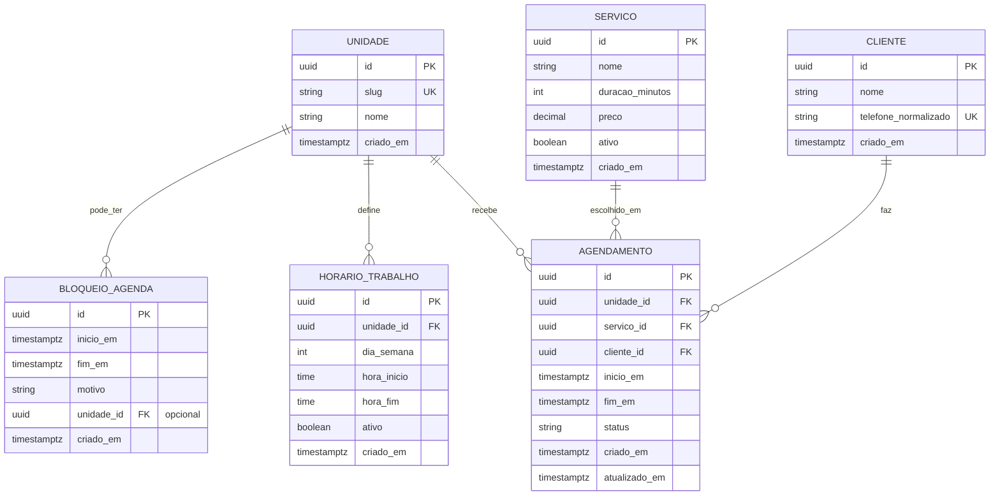

# Arquitetura do Banco — Postgres (Prisma) — Sistema de Agendamento v1

**Documento ID:** ARCH-DB-v1-AGENDAMENTO-001  
**Data:** 2026-02-04  
**Status:** Draft (Pronto para Migrations)  
**Banco:** Postgres  
**ORM:** Prisma  

---

## 1) Premissas e Objetivos

### 1.1 Premissas
- Um barbeiro único atende em duas unidades.
- Disponibilidade é derivada (não existe “tabela de slots”).
- Cliente agenda sem login (nome + telefone).
- Admin faz CRUD e opera status.

### 1.2 Objetivos
- Garantir consistência e integridade por constraints.
- Garantir **zero sobreposição** de agendamentos ativos (hard guarantee no banco).
- Suportar consultas de disponibilidade por range de datas com performance previsível.

---

## 2) Diagrama ER (Mermaid)



---

## 3) Entidades e Constraints

### 3.1 UNIDADE
**Campos**
- `id` UUID PK
- `slug` UNIQUE (`unidadeA`, `unidadeB`)
- `nome`
- `criado_em`

**Índices/Constraints**
- `UNIQUE(slug)`

---

### 3.2 SERVICO
**Campos**
- `nome`
- `duracao_minutos` (minutos)
- `preco` (decimal)
- `ativo` (bool)
- `criado_em`

**Checks**
- `duracao_minutos > 0`
- `preco >= 0`

**Índices**
- `INDEX(ativo)`

---

### 3.3 HORARIO_TRABALHO
**Semântica**
- regra semanal por unidade
- permite múltiplas janelas por dia (manhã/tarde)

**Campos**
- `unidade_id`
- `dia_semana` (0-6)
- `hora_inicio` / `hora_fim` (time)
- `ativo`

**Checks**
- `dia_semana BETWEEN 0 AND 6`
- `hora_inicio < hora_fim`

**Índices**
- `INDEX(unidade_id, dia_semana)`
- (Opcional) `INDEX(unidade_id, dia_semana, ativo)`

---

### 3.4 BLOQUEIO_AGENDA
**Semântica**
- `unidade_id IS NULL` = bloqueio global (barbeiro indisponível em qualquer unidade)
- `unidade_id NOT NULL` = bloqueio específico

**Campos**
- `inicio_em` / `fim_em` (timestamptz)
- `motivo`
- `unidade_id (nullable)`

**Checks**
- `inicio_em < fim_em`

**Índices**
- `INDEX(inicio_em)`
- `INDEX(fim_em)`
- `INDEX(unidade_id)`

---

### 3.5 CLIENTE
**Campos**
- `nome`
- `telefone_normalizado` (UNIQUE)
- `criado_em`

**Notas**
- normalização pode seguir E.164 ou padrão interno consistente (ex.: apenas dígitos + DDI)
- no back, sempre comparar pelo normalizado

**Índices/Constraints**
- `UNIQUE(telefone_normalizado)`
- `INDEX(telefone_normalizado)`

---

### 3.6 AGENDAMENTO
**Status válidos (V1)**
- `Confirmado`
- `CanceladoCliente`
- `CanceladoBarbeiro`
- `EmAtendimento`
- `Concluido`
- `Falta`

**Campos**
- `unidade_id`, `servico_id`, `cliente_id`
- `inicio_em`, `fim_em` (timestamptz)
- `status`
- `criado_em`, `atualizado_em`

**Checks**
- `inicio_em < fim_em`

**Índices**
- `INDEX(inicio_em)`
- `INDEX(fim_em)`
- `INDEX(status)`
- `INDEX(unidade_id, inicio_em)`
- `INDEX(cliente_id, inicio_em)`

---

## 4) Regra crítica: Zero sobreposição (hard guarantee)

### 4.1 Estratégia (Postgres)
Usar **Exclusion Constraint** com `tstzrange` para impedir overlaps entre agendamentos “ativos”.

**Status considerados ativos:**
- `Confirmado`
- `EmAtendimento`

**SQL (migration manual)**
```sql
CREATE EXTENSION IF NOT EXISTS btree_gist;

ALTER TABLE agendamento
ADD CONSTRAINT agendamento_sem_sobreposicao
EXCLUDE USING gist (
  tstzrange(inicio_em, fim_em, '[)') WITH &&
)
WHERE (status IN ('Confirmado', 'EmAtendimento'));
```

### 4.2 Implicações
- Segurança contra concorrência (duas reservas simultâneas no mesmo slot).
- Cancela/conclui: o range deixa de bloquear (não entra no WHERE).

---

## 5) Estratégias de Consulta (Query Patterns)

### 5.1 Disponibilidade (read)
Para montar disponibilidade, consultas típicas:

- janelas de trabalho: `HORARIO_TRABALHO WHERE unidade_id AND dia_semana AND ativo`
- bloqueios: `BLOQUEIO_AGENDA WHERE (unidade_id IS NULL OR unidade_id = ?) AND range overlaps`
- ocupações: `AGENDAMENTO WHERE status IN (Confirmado, EmAtendimento) AND range overlaps`

**Regra de performance:** sempre filtrar por intervalo (dia/semana) e usar índices em `inicio_em`.

---

## 6) Migrations, Seed e Ambientes

### 6.1 Prisma schema
- `schema.prisma` define tabelas e relações.
- constraints avançadas (exclusion constraint) via SQL migration manual.

### 6.2 Seed
- seed de `UNIDADE` (A e B)
- seed opcional de `SERVICO` (se fizer sentido)

---

## 7) Auditoria e Histórico (V1)
- mínimo: `criado_em`, `atualizado_em`
- V2: tabela de histórico/event store, se necessário (não recomendado para V1)

---

## 8) Backups e Operação (Railway)
- seguir políticas do Postgres gerenciado do Railway
- definir rotina de export (dump) se a operação exigir

---

## 9) Checklist de Validação do Banco

- [ ] `UNIQUE(unidade.slug)`
- [ ] `CHECK(servico.duracao_minutos > 0)`
- [ ] `CHECK(horario_trabalho.hora_inicio < hora_fim)`
- [ ] `CHECK(bloqueio.inicio_em < fim_em)`
- [ ] `CHECK(agendamento.inicio_em < fim_em)`
- [ ] `EXCLUDE overlap` ativo aplicado com sucesso
- [ ] Índices críticos criados (`inicio_em`, `status`, `unidade_id+inicio_em`)

---

## 10) Próximo passo
Com o banco fechado, a próxima execução é detalhar os 4 módulos na **Arquitetura Micro** (um arquivo por módulo) e iniciar implementação por:  
1) Catálogo + Agenda (admin) → 2) Disponibilidade → 3) Agendamentos.
