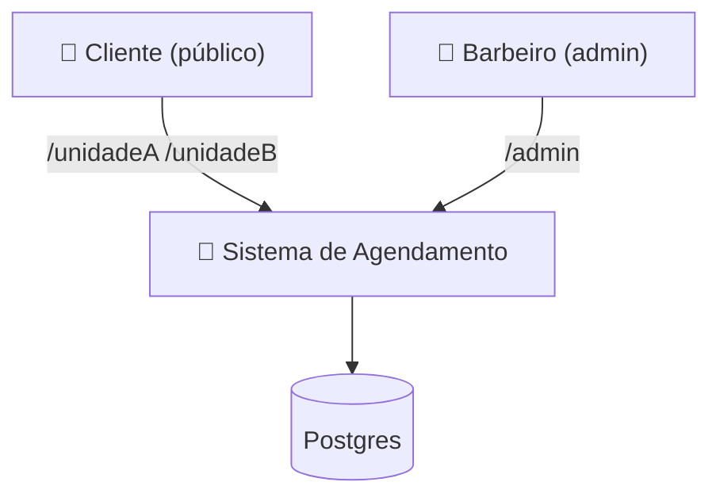
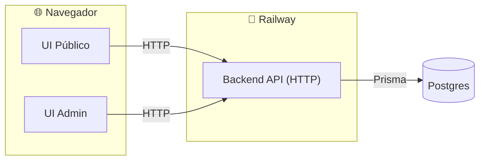
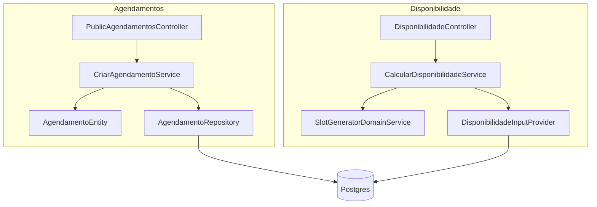
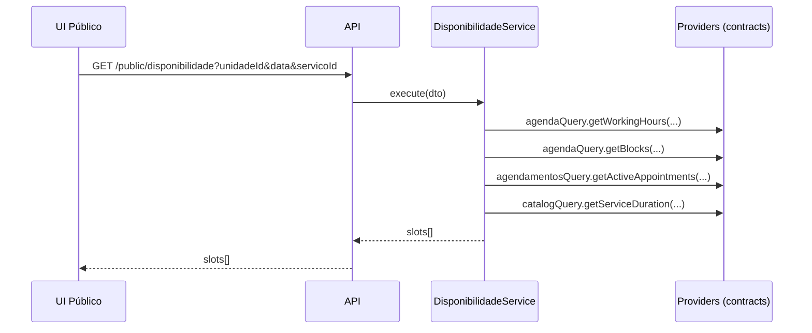
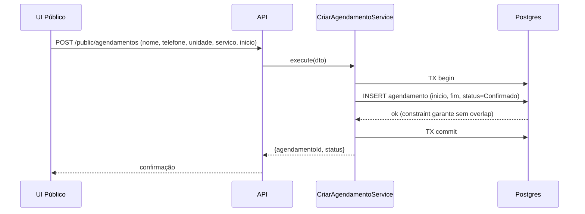
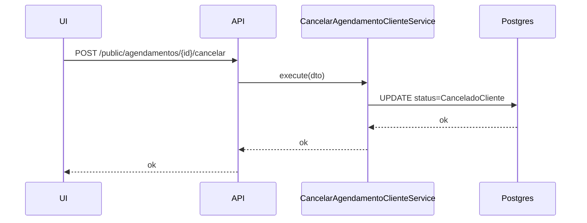
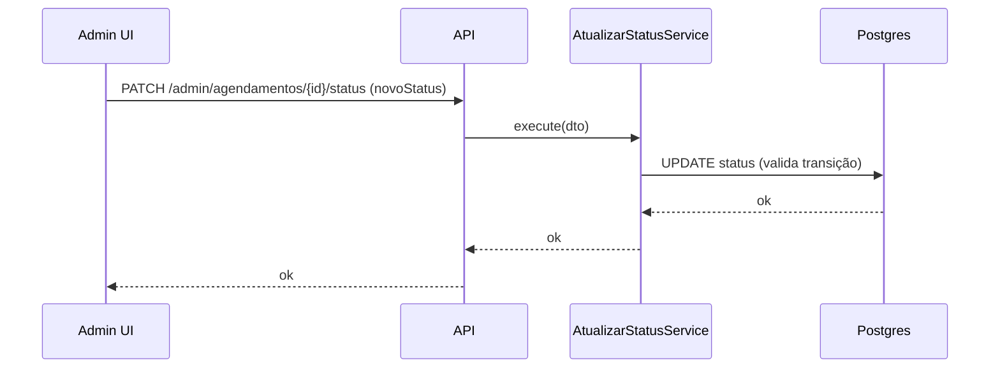

# Arquitetura Macro — Sistema de Agendamento (Barbeiro Único — 2 Unidades) v2.0

**Documento ID:** ARCH-MACRO-v2-AGENDAMENTO-001  
**Data:** 2026-02-04  
**Status:** Draft (Pronto para Implementação V1)  
**Stack-alvo (execução):** Railway + Postgres + Prisma  

---

## 1) Visão Geral

### 1.1 Propósito do Sistema
Sistema de agendamento online para **um barbeiro único** que atende em **duas unidades** (Unidade A e Unidade B). O sistema:

- expõe páginas públicas separadas por unidade: `/unidadeA` e `/unidadeB`
- permite agendamento **sem login** (nome + telefone)
- calcula **disponibilidade real** por unidade e dia
- impede **sobreposição** de horários (um barbeiro só, inclusive entre unidades)
- oferece painel **admin** para manter serviços, horários, bloqueios e agenda

### 1.2 Objetivos (V1)
- **Zero slot fantasma:** disponibilidade sempre derivada de dados reais
- **Zero conflito:** não permitir agendamentos simultâneos
- **Fricção mínima para o cliente:** sem conta/senha
- **Operação simples:** admin com CRUD + visão de agenda + transições de status

### 1.3 Fora de escopo (V2+)
- lembretes (WhatsApp/SMS/Email), OTP, pagamento/sinal, integração Google Calendar, relatórios avançados

---

## 2) Metodologia Organizacional

### 2.1 Arquitetura escolhida
**Modular Domain Layered Architecture** (Feature-Based Modules + Camadas internas por módulo):

- **modules/**: divisão por domínio (bounded contexts)
- cada módulo tem: `controllers/`, `services/`, `domain/`, `repository/`, `events/`, `dtos/`, `interfaces/`, `utils/`
- **common/**: somente infra/cross-cutting (DB client, http server, logger, errors, middlewares, contracts)

### 2.2 Fluxo padrão por módulo
```
HTTP Controller → Service (Use Case) → Domain (Entities/VO/Rules) → Repository → Prisma/Postgres
```

---

## 3) Estrutura de Pastas (Backend)

> Regra operacional: manter profundidade máxima (a partir de `src/`) em 4 níveis; nomes previsíveis; shared/common **sem regra de negócio**.

```
src/
 ├── common/
 │    ├── infrastructure/
 │    │    ├── database/
 │    │    │    ├── prisma-client.ts
 │    │    │    └── migrations/        # (migrations vivem em /prisma, aqui é só referência)
 │    │    ├── http/
 │    │    │    ├── server.ts
 │    │    │    ├── router.ts
 │    │    │    └── middlewares/
 │    │    └── event-bus/
 │    │         ├── event-bus.ts       # in-process (V1)
 │    │         └── types.ts
 │    ├── logging/
 │    │    └── logger.ts
 │    ├── errors/
 │    │    ├── app-error.ts
 │    │    └── http-errors.ts
 │    ├── validation/
 │    │    ├── validators.ts
 │    │    └── schemas/
 │    ├── contracts/
 │    │    ├── agenda.contract.ts
 │    │    ├── catalogo.contract.ts
 │    │    └── agendamentos.contract.ts
 │    └── utils/
 │         ├── date.ts
 │         └── telefone.ts
 │
 ├── modules/
 │    ├── catalogo/
 │    ├── agenda/
 │    ├── agendamentos/
 │    └── disponibilidade/
 │
 ├── config/
 │    ├── env.ts
 │    └── constants.ts
 │
 └── main.ts

prisma/
 ├── schema.prisma
 ├── migrations/
 └── seed.ts

tests/
 ├── unit/
 ├── integration/
 └── e2e/
```

---

## 4) Mapa de Módulos (Bounded Contexts)

### 4.1 Visão de alto nível
- **MOD-001 — Catálogo:** Unidades + Serviços (CRUD admin + listagem pública de serviços ativos)
- **MOD-002 — Agenda:** Horários de trabalho por unidade + Bloqueios (exceções)
- **MOD-003 — Agendamentos:** Cliente + Agendamento + Ciclo de vida (status, cancelamento, atendimento)
- **MOD-004 — Disponibilidade:** Slots derivados (não persistidos) para consulta pública

### 4.2 Dependências (sem ciclos)
- Disponibilidade **consulta** Catálogo (duração de serviço), Agenda (janelas/bloqueios) e Agendamentos (ocupações).
- Agendamentos **não depende** de Disponibilidade para criar (ele valida diretamente conflito via dados + constraint).
- Catálogo e Agenda não dependem dos outros módulos.

```mermaid
graph LR
  CAT[MOD-001 Catálogo] -->|contract: IServicoCatalogQuery| DSP[MOD-004 Disponibilidade]
  AGD[MOD-002 Agenda] -->|contract: IAgendaQuery| DSP
  AGE[MOD-003 Agendamentos] -->|contract: IAgendamentosQuery| DSP

  AGE -->|events (opcional p/ cache/telemetria)| EB[(EventBus in-process)]
  EB --> DSP
```

---

## 5) C4 Model

### 5.1 Context (Sistema no ecossistema)


### 5.2 Container (Deploy)


### 5.3 Component (por domínio, visão simplificada)


---

## 6) Contratos entre Módulos (Ports)

### 6.1 Contracts (Common)
- `IServicoCatalogQuery`: duração/preço/ativo do serviço
- `IAgendaQuery`: janelas de trabalho + bloqueios
- `IAgendamentosQuery`: agendamentos ativos por range (para cálculo)

**Regra:** módulos não importam classes/serviços concretos de outros módulos; somente **contracts**.

---

## 7) Fluxos principais (E2E)

### 7.1 Público — Consultar disponibilidade


### 7.2 Público — Criar agendamento (happy path)


### 7.3 Público — Cancelar agendamento


### 7.4 Admin — Operar status


---

## 8) Regras e Invariantes do Domínio

### 8.1 Agendamento (regras críticas)
- `inicio < fim`
- `fim = inicio + duracaoServico`
- status permitido:
  - Confirmado
  - CanceladoCliente
  - CanceladoBarbeiro
  - EmAtendimento
  - Concluido
  - Falta
- **não pode sobrepor** outro agendamento ativo (Confirmado, EmAtendimento)

### 8.2 Disponibilidade (derivação)
- slots = janelas de trabalho (por unidade) − bloqueios (globais e/ou por unidade) − agendamentos ativos
- **não persiste** slots em tabela (evita inconsistência)

---

## 9) Padrões Arquiteturais Aplicados
- Repository Pattern (per módulo)
- DTOs (entrada/saída)
- Domain Events (V1 in-process; V2 evolui para fila)
- Ports & Adapters (contracts para comunicação entre módulos)
- Result Pattern (recomendado para Services: sucesso/erro sem exception de domínio)

---

## 10) Convenções e Guidelines

### 10.1 Nomeação
- pastas: `kebab-case`
- arquivos: `[recurso].[camada].ts` (ex.: `criar-agendamento.service.ts`)
- métodos: verbos explícitos

### 10.2 Erros e HTTP
- Erros de domínio: `409 Conflict` (slot já ocupado), `422 Unprocessable Entity` (regra inválida), `404 Not Found`, `401/403` admin
- Erros técnicos: `500` com `requestId`

### 10.3 Timezone
- armazenar `inicio_em` e `fim_em` como `timestamptz` no Postgres
- API aceita/retorna ISO (com offset)

---

## 11) Observabilidade (V1)
- logging estruturado com `requestId`
- métricas mínimas: latência de endpoints críticos e taxa de conflito (409)

---

## 12) Segurança (V1)
- Público: sem login (requisito). O “gerenciar por telefone” é conveniência, não segurança forte.
- Admin: middleware simples (token) + rate limit básico.

---

## 13) Deploy e Operação (Railway)

### 13.1 Runtime
- Service `api` (Node) + `postgres`

### 13.2 Migrações
- `prisma migrate deploy` no boot do deploy
- `seed` somente em ambiente dev/test (em prod, seed apenas para unidades/serviços iniciais se necessário)

### 13.3 Variáveis
- `DATABASE_URL`
- `NODE_ENV`
- `PORT`
- `ADMIN_TOKEN`
- `APP_BASE_URL`

---

## 14) Checklist de Validação (antes do código)

- [ ] Sem dependências circulares entre módulos
- [ ] `common/` não contém regra de negócio
- [ ] Disponibilidade não persiste slots
- [ ] Postgres protege overlap via constraint (DB doc)
- [ ] E2E cobre: consultar disponibilidade, criar, cancelar, admin status

---

## 15) Próximo passo
Gerar **Arquitetura Micro** por módulo (4 documentos):  
`catalogo`, `agenda`, `agendamentos`, `disponibilidade`.
